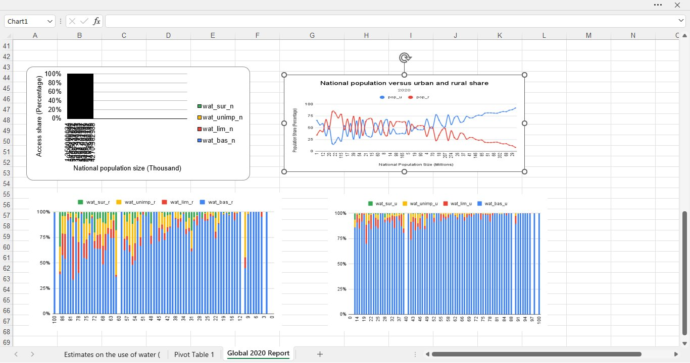
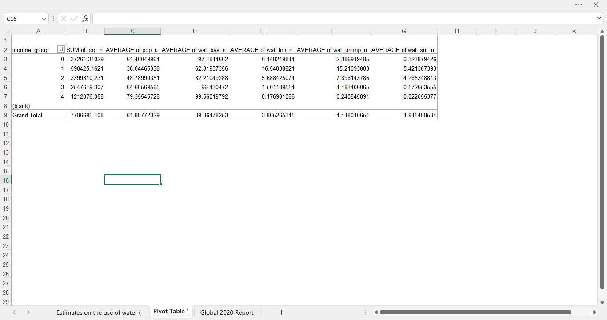

# Project 1: Global Drinking Water Access Analysis

## Overview
An integrated data analytics project investigating global access 
to safe and affordable drinking water, aligned with UN Sustainable 
Development Goal 6 (Clean Water & Sanitation).

Completed as part of the ALX Africa Data Analytics programme using 
real-world data from the WHO/UNICEF Joint Monitoring Programme (JMP).

## Datasets Used
- `Regions.csv` — 231 countries mapped to World Bank regions
- `water_2020.csv` — Water access snapshot for 208 countries (2020)
- `water_2000_2020.csv` — Time-series data across 231 countries (2015–2020)

## Tools Used
- Microsoft Excel
- CSV data processing
- Pivot Tables and Charts
- Statistical analysis: averages, distributions, Annual Rate of Change (ARC)

---

## 📊 Visualizations

### Global 2020 Dashboard — Water Access by Population

### Pivot Table — Water Access by Income Group

---

## Key Findings

### 🌍 Global Population & Access (2020)
- Total world population covered in dataset: **7.76 billion**
- Average national basic water access: **90.1%**
- Median national basic water access: **97.4%**
- Lowest national basic water access recorded: **37.2%**

### 🏙️ Urban vs Rural Gap
- Average urban basic water access: **94.9%**
- Average rural basic water access: **81.5%**
- Urban-Rural gap: **13.4 percentage points**
- Rural populations consistently have significantly lower access 
  to safe drinking water than urban populations across all regions.

### 💧 Countries Most Reliant on Surface Water (Highest Risk)
| Country | Surface Water Usage |
|---------|-------------------|
| Papua New Guinea | 30.4% |
| Kenya | 19.0% |
| Angola | 14.1% |
| Tanzania | 13.5% |
| Liberia | 12.5% |

### 📈 Annual Rate of Change (ARC) — 2015 to 2020
| Area | Average ARC |
|------|------------|
| National | +0.277% per year |
| Rural | +0.485% per year |
| Urban | +0.154% per year |

Rural areas are improving **faster** than urban areas, suggesting 
targeted investment in rural water infrastructure is yielding results.

### 🏆 Top 5 Fastest Improving Countries
| Country | National ARC |
|---------|-------------|
| Afghanistan | +2.75% per year |
| Mozambique | +2.44% per year |
| Timor-Leste | +2.05% per year |
| Myanmar | +2.03% per year |
| **Nigeria** | **+1.77% per year** |

### ⚠️ Countries with Declining Water Access
| Country | National ARC |
|---------|-------------|
| Central African Republic | -1.02% per year |
| Burkina Faso | -0.58% per year |
| Zimbabwe | -0.47% per year |
| Solomon Islands | -0.41% per year |
| North Korea | -0.27% per year |

### 🌐 ARC by World Region
| Region | Average ARC |
|--------|------------|
| Sub-Saharan Africa | +0.558% per year |
| South Asia | +0.480% per year |
| Middle East & North Africa | +0.346% per year |
| East Asia & Pacific | +0.278% per year |
| Latin America & Caribbean | +0.144% per year |
| Europe & Central Asia | +0.112% per year |
| North America | +0.017% per year |

Sub-Saharan Africa and South Asia are improving the fastest — 
regions that historically had the lowest access levels.

---

## Skills Demonstrated
- Real-world dataset import and cleaning
- Pivot Table analysis by income group
- Feature engineering (ARC calculations)
- Cross-country and cross-regional comparative analysis
- Data visualization and dashboard creation
- Interpreting findings in the context of global development goals

## Data Source
WHO/UNICEF Joint Monitoring Programme (JMP) — https://washdata.org
