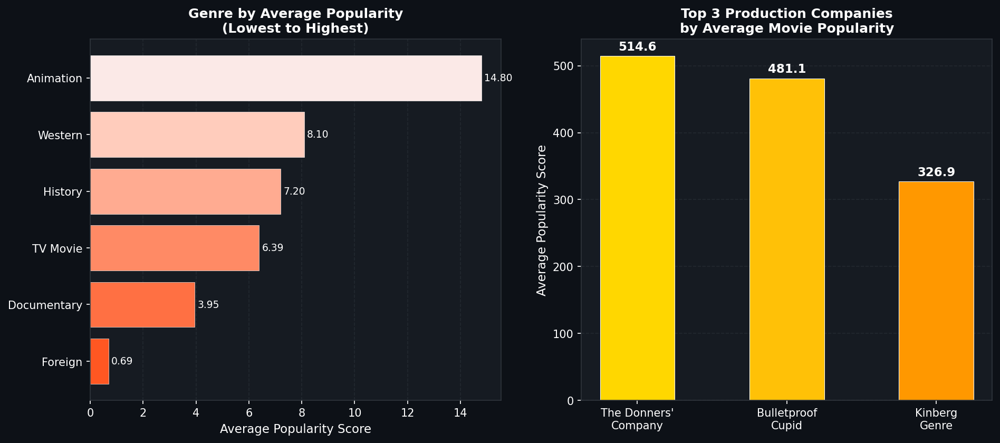

# Project 3: TMDB SQL Exam

## Overview
A SQL examination using The Movie Database (TMDb) — a real-world dataset 
containing information about movies, actors, genres, production companies, 
and Oscar award records.

Completed as part of the ALX Africa / ExploreAI Data Analytics SQL assessment.

## Database Structure
The TMDb database contains **12 tables**:

| Table | Description | Rows |
|-------|-------------|------|
| movies | Movie details (title, budget, revenue, popularity) | 4,803 |
| actors | Actor names and gender | 54,588 |
| casts | Movie-actor relationships with characters | 106,257 |
| genres | Genre categories | 20 |
| genremap | Movie-genre links | 12,160 |
| keywords | Keyword tags | 9,813 |
| keywordmap | Movie-keyword links | 36,194 |
| oscars | Oscar nominations and winners | 9,964 |
| productioncompanies | Production company names | 5,047 |
| productioncompanymap | Movie-company links | 13,677 |
| languages | Language codes | 87 |
| languagemap | Movie-language links | 6,937 |

## Tools Used
- SQLite / MySQL
- SQL concepts: JOINs, GROUP BY, HAVING, subqueries, LIKE, SUBSTR, UPDATE, CREATE VIEW

---

## Exam Questions & Answers

| # | Question | Answer |
|---|----------|--------|
| 1 | Oscar winner "Actor in Leading Role" 2015 | **Leonardo DiCaprio** |
| 2 | Query for ten oldest movies | `SELECT * FROM movies WHERE release_date IS NOT NULL ORDER BY release_date ASC LIMIT 10` |
| 3 | Unique awards in Oscars table | **114** |
| 4 | Movies with "Spider" in title | **9** |
| 5 | Thriller genre + "love" keyword movies | **48** |
| 6 | Movies Aug 2006–Oct 2009, popularity > 40, budget < 50M | **29** |
| 7 | Unique characters played by Vin Diesel | **16** |
| 8 | Genres of "The Royal Tenenbaums" | **Drama, Comedy** |
| 9 | Top 3 production companies by avg popularity | **The Donners' Company, Bulletproof Cupid, Kinberg Genre** |
| 10 | Female actors (gender=1) with name starting with "N" | **355** |
| 11 | Genre with lowest average popularity | **Foreign** |
| 12 | Award category with most actor nominations | **Actor in a Supporting Role** |
| 13 | Fix pre-1934 year format in Oscars | `UPDATE Oscars SET year = substr(year, -4)` |
| 14 | Create VIEW for Alan Rickman movies | `CREATE VIEW Alan_Rickman_Movies AS SELECT...` |
| 15 | True statements about normalisation | **Statements i and iii** |

---

## 📊 Visualizations

### Genre Popularity & Top Production Companies

---

## Key SQL Techniques Demonstrated

**Multi-table JOINs** — Questions 5, 8, 9, 12, 14 required joining 3-4 tables

**Aggregate functions** — COUNT, AVG, SUM with GROUP BY and ORDER BY

**String functions** — LIKE for pattern matching, SUBSTR for string manipulation

**Data manipulation** — UPDATE statements for data cleaning

**View creation** — CREATE VIEW for reusable query results

**Subqueries** — Used in WHERE clauses for filtering

---

## Files
- `tmdb_sql_exam.sql` — All 15 exam questions with correct SQL queries and answers

## Data Source
The Movie Database (TMDb) — https://www.themoviedb.org
