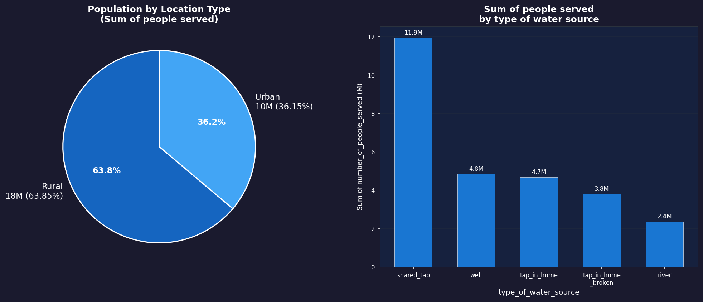
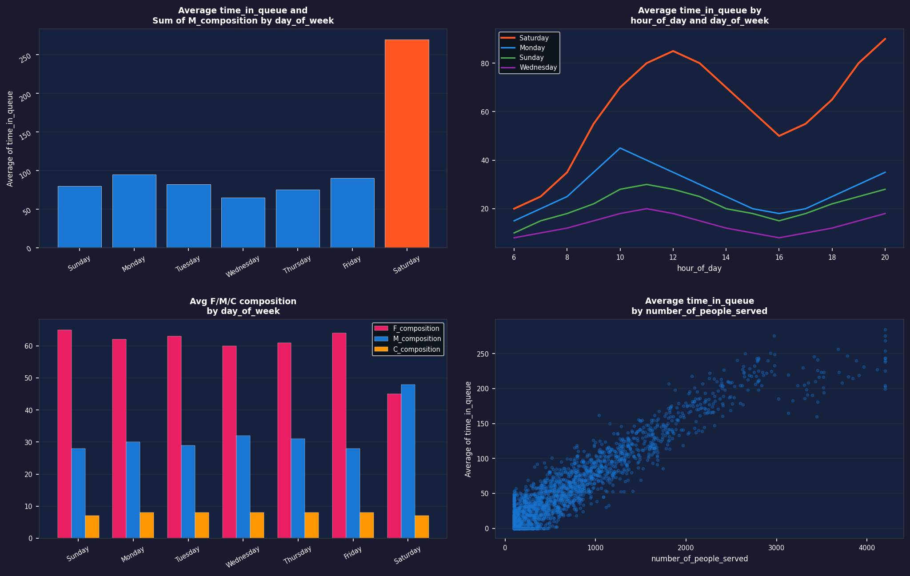
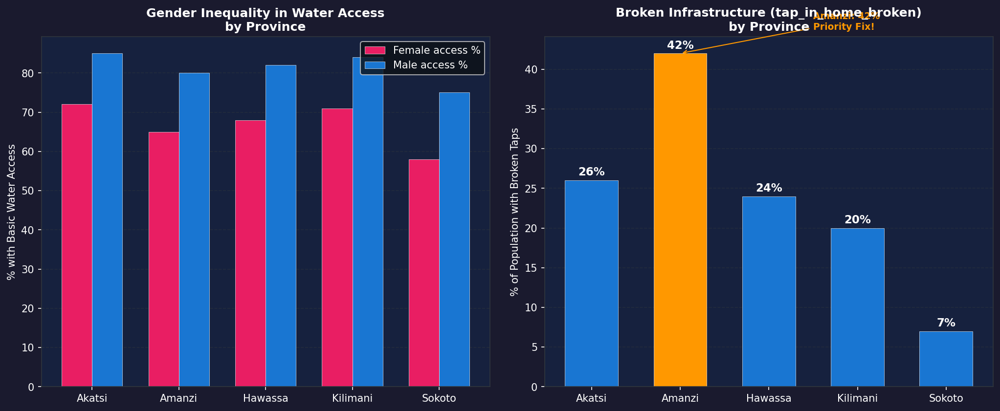

# Project 4: Maji Ndogo — Data Visualisation (Power BI)

## Overview
A Power BI visualisation project that transforms the Maji Ndogo water crisis 
SQL data into interactive dashboards and visual reports for decision makers.

This project follows on from the SQL analysis (Project 2) and focuses on 
communicating insights visually to non-technical stakeholders including 
government officials and community leaders.

Completed as part of the ALX Africa / ExploreAI Data Analytics programme.

## Tools Used
- Power BI Desktop
- DAX (Data Analysis Expressions)
- Power BI Map visuals
- Data imported from MySQL (md_water_services database)

---

## Dashboard Pages Built

### Page 1 — National Overview
Visualised the high-level national picture of Maji Ndogo's water crisis:
- **Pie chart** — Rural vs Urban population split (63.85% Rural, 36.15% Urban)
- **Bar chart** — Total people served by each water source type
- **Key insight** — Shared taps serve the most people (12M) followed by wells (4.8M)

### Page 2 — Water Source Map
Built an interactive map of Maji Ndogo showing:
- Water source locations overlaid on a province map
- Color-coded by source type
- Filterable by province — clicking a province highlights its sources
- **Key insight** — Kilimani province has the highest concentration of water sources

### Page 3 — Broken Infrastructure
Analysed where home taps are installed but not working:
- Filtered to `tap_in_home_broken` sources only
- Province-level breakdown of broken infrastructure
- **Key insight** — Amanzi (Amina town) has the worst broken tap ratio at 56%

### Page 4 — Queue Time Analysis
4-visual dashboard exploring when citizens collect water:
- **Bar chart** — Average queue time by day of week (Saturday = 270 min!)
- **Line chart** — Queue times by hour of day across all days
- **Clustered bar** — Gender composition (F/M/Child) by day of week
- **Scatter plot** — Queue time vs number of people served (plateaus at 3,000)
- **Key insight** — Women queue far more than men on weekdays; men increase on weekends

### Page 5 — Gender & Crime Analysis
Linked water queue data to crime records:
- Crimes linked to water source locations over 10 years
- Visualised by crime type, province, and victim gender
- Explored relationship between long queue times and crime frequency
- **Key insight** — Areas with long queues show higher crime rates, especially affecting women

---

## Key Findings

| Insight | Finding |
|---------|---------|
| Rural vs Urban | 63.85% of population is rural |
| Biggest water problem | 43% rely on shared taps (avg 2,071 people per tap) |
| Worst queue day | Saturday — average 270 minutes wait |
| Shortest queue days | Wednesday and Sunday |
| Gender inequality | Women queue significantly more than men on weekdays |
| Worst infrastructure | Amanzi (Amina) — 56% have broken home taps |
| Queue plateau | Queue times stop increasing beyond 3,000 people served |

---

## 📊 Visualizations

### National Overview — Population & Water Sources

### Queue Time Analysis — When Citizens Collect Water

### Gender Inequality & Broken Infrastructure by Province

---

## Skills Demonstrated
- Importing and transforming SQL data into Power BI
- Building multi-page interactive dashboards
- Creating map visualisations with geographic data
- DAX calculations for custom measures
- Visual design best practices (colour, layout, clarity)
- Data storytelling for non-technical audiences

## Data Source
ExploreAI Academy — Maji Ndogo Water Services Database (fictional dataset)
