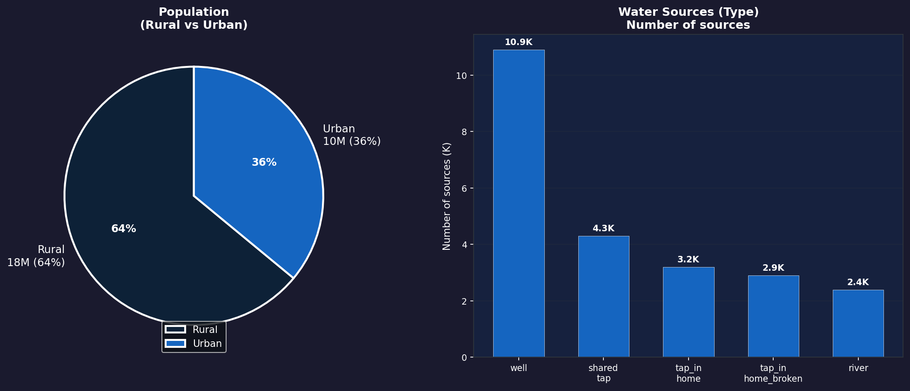
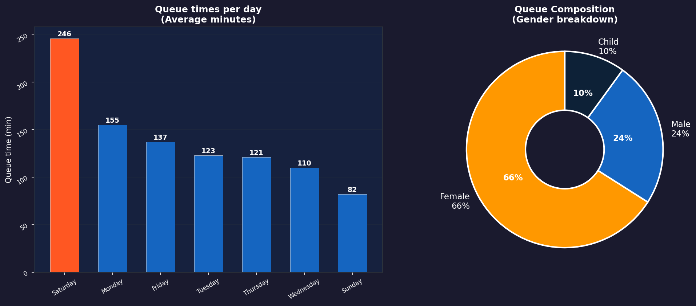
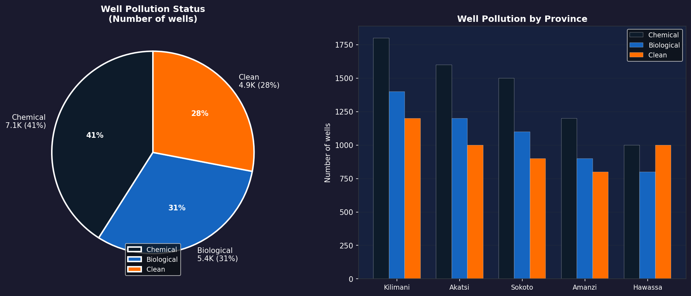
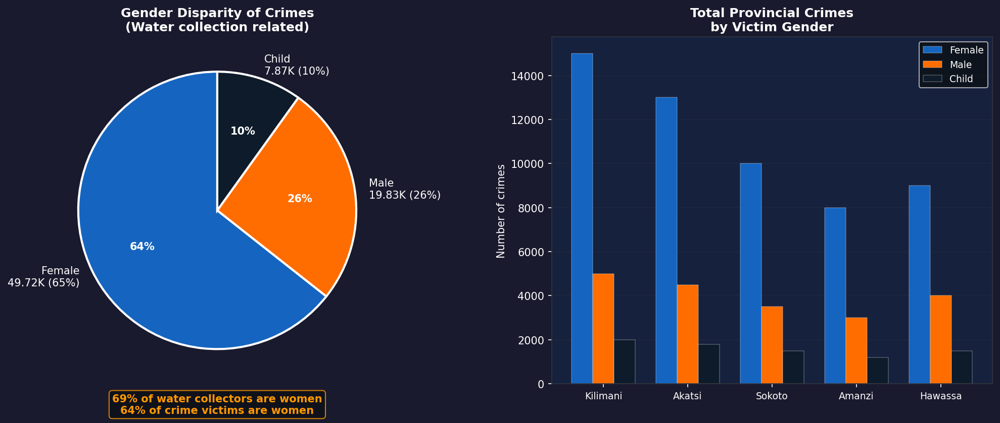

# Project 5: Maji Ndogo — Moulding Data into Visual Stories (Power BI)

## Overview
The second Power BI visualisation project for Maji Ndogo, building on the 
SQL analysis and first visualisation project. This project focuses on 
building a proper Power BI data model, creating polished dashboards, 
and uncovering a critical link between water access and crime against women.

Completed as part of the ALX Africa / ExploreAI Data Analytics programme.

## Tools Used
- Power BI Desktop
- DAX (Data Analysis Expressions)
- Power BI data model (relationships management)
- Power BI Map visuals and Treemap
- Data imported from MySQL (md_water_services database)

---

## Key Concepts Covered

### 1. Building a Power BI Data Model
- Imported 6 tables: `visits`, `water_source`, `well_pollution`, 
  `queue_composition`, `project_progress`, `infrastructure_cost`, 
  `water_source_related_crime`
- Resolved **many-to-many relationship** between crime and visits tables
  using the `location` table as a bridging table
- Configured proper one-to-many relationships across all tables

### 2. National Scale Dashboard
- **Province map** — colour-coded choropleth of Maji Ndogo's 5 provinces
- **Treemap** — water source distribution by type and province
- **Population pie** — Rural (64%) vs Urban (36%) split
- **Bar chart** — count of water sources by type

### 3. Queue Visualisation Dashboard
- **Queue times per day** — Saturday worst at 246 minutes
- **Queue composition donut** — Female 66%, Male 24%, Child 10%
- **Queue by hour of day** — line chart showing peak collection times
- **Total time in queues by province** — Kilimani and Akatsi highest

### 4. Well Pollution Map
- **Province map** — colour-coded by pollution severity
- **Pollution status pie** — Chemical 41%, Biological 31%, Clean 28%
- **Province breakdown** — Kilimani has highest number of contaminated wells
- Key insight: Only 28% of wells are clean — majority need filtering

### 5. Crime & Water Analysis
- Linked crime data to water source locations
- Revealed critical gender disparity in crime victimisation
- Created formatted report page for decision makers

---

## Key Findings

| Insight | Finding |
|---------|---------|
| Queue peak day | Saturday — 246 minutes average wait |
| Shortest queue day | Sunday — 82 minutes average |
| Water collectors | 69% are women |
| Crime victims | 64% are women (water-related crimes) |
| Peak crime time | Friday & Saturday at 22:00 |
| Well contamination | Only 28% of wells are clean |
| Chemical contamination | 41% of wells (highest risk) |
| Biological contamination | 31% of wells |
| Worst province (crime) | Kilimani — highest total crimes |

---

## 📊 Visualizations

### National Scale — Province Map & Water Sources

### Queue Analysis — Times & Gender Composition

### Well Pollution — Status & Province Breakdown

### Crime & Water — Gender Disparity Analysis

---

## Skills Demonstrated
- Building and managing Power BI data models
- Resolving many-to-many relationship conflicts
- Creating choropleth maps and treemaps
- DAX measures for custom calculations
- Multi-page dashboard design
- Data storytelling — linking water access to social outcomes
- Report design for non-technical decision makers

## Data Source
ExploreAI Academy — Maji Ndogo Water Services Database (fictional dataset)
