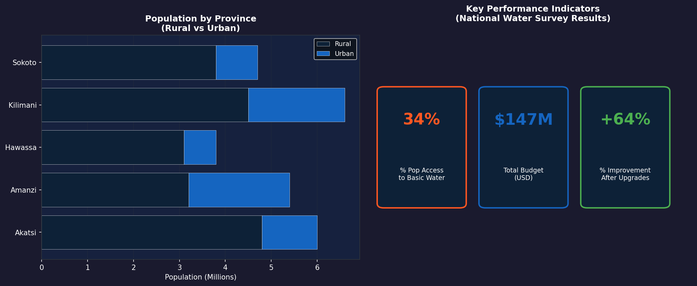
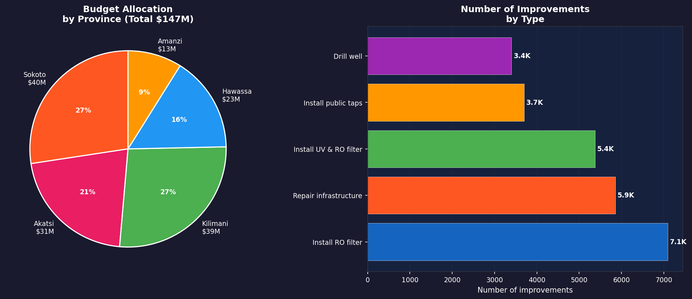
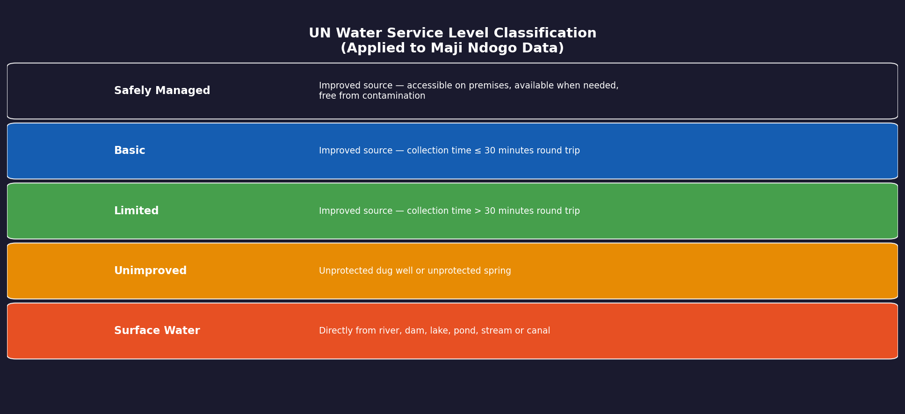
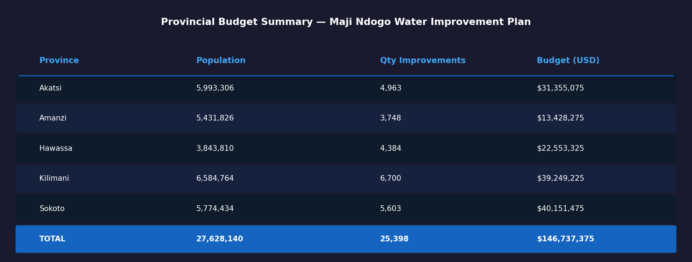

# Project 6: Maji Ndogo — Communicating Findings (Power BI Report)

## Overview
The final Power BI report project for Maji Ndogo — building a polished, 
executive-level report for President Naledi to help her make data-driven 
decisions on water infrastructure investments across the country.

This project focuses on **report design for decision-makers**, translating 
complex data analysis into clear, actionable visual stories with budget 
breakdowns, improvement plans, and provincial-level insights.

Completed as part of the ALX Africa / ExploreAI Data Analytics programme.

## Tools Used
- Power BI Desktop
- DAX (Data Analysis Expressions) — custom measures for water access %
- Power BI Bookmarks — toggle buttons between Province and Improvement views
- Power BI Slicers — interactive province selector
- Data imported from MySQL (md_water_services + infrastructure_cost tables)

---

## Report Structure

### Page 1 — National Overview (Executive Summary)
Designed for President Naledi to see the big picture at a glance:
- **Province selector** — slicer to filter entire report by province
- **Interactive map** — highlights selected province on Maji Ndogo map
- **KPI Cards** — 3 high-impact statistics:
  - Current basic water access: **34%**
  - Total budget required: **$147M**
  - Population improvement after upgrades: **+64%**
- **Population chart** — Rural vs Urban by province
- **Water source chart** — Population by source type
- **Improvements chart** — Number of upgrades needed by province
- **Improvement type chart** — Breakdown of what work needs to be done

### Page 2 — Budget & Financial Planning
Financial breakdown to help allocate funds:
- **Province budget table** — Population, quantity of improvements, budget per province
- **Improvement type table** — Cost breakdown by type of upgrade
- **Toggle bookmark** — Switch between Province and Improvement views
- **Budget pie chart** — % of total budget allocated per province

### Page 3 — Water Access Classification (Data Enrichment)
Applied UN water service level standards to Maji Ndogo data:
- Classified each water source into 5 UN service levels
- Used DAX to calculate % population with basic access
- This classification drives the 34% headline KPI

---

## Key Findings

| Metric | Value |
|--------|-------|
| Current basic water access | **34%** of population |
| Total improvement budget | **$147 Million** |
| Population benefiting from upgrades | **+64%** |
| Total improvements required | **25,398** |
| Largest improvement type | Install RO filter (7,093) |
| Most expensive province | Sokoto ($40M) |
| Least expensive province | Amanzi ($13M) |

## Provincial Budget Breakdown

| Province | Population | Improvements | Budget |
|----------|-----------|--------------|--------|
| Akatsi | 5,993,306 | 4,963 | $31,355,075 |
| Amanzi | 5,431,826 | 3,748 | $13,428,275 |
| Hawassa | 3,843,810 | 4,384 | $22,553,325 |
| Kilimani | 6,584,764 | 6,700 | $39,249,225 |
| Sokoto | 5,774,434 | 5,603 | $40,151,475 |
| **TOTAL** | **27,628,140** | **25,398** | **$146,737,375** |

---

## 📊 Visualizations

### National Report Dashboard — KPIs & Population Overview

### Budget Allocation & Improvement Types

### UN Water Service Level Classification

### Provincial Budget Summary Table

---

## Skills Demonstrated
- Executive report design for non-technical stakeholders
- DAX custom measures (basic water access %, improvement %)
- Power BI bookmarks for interactive toggle buttons
- Province-level slicer with map integration
- KPI card design and layout
- Translating SQL analysis results into actionable visual reports
- Budget and financial data visualisation

## Data Source
ExploreAI Academy — Maji Ndogo Water Services Database (fictional dataset)
